# Análisis de patrones de uso de usuarios de bicicletas en Cyclistic

## Antecedentes y visión general

En 2016, Cyclistic lanzó una exitosa oferta de bicicletas compartidas. Desde entonces, el 
programa ha crecido hasta contar con una flota de 5,824 bicicletas que están geo
 localizadas y bloqueadas en una red de 692 estaciones en Chicago. Las bicicletas
 se pueden desbloquear en una estación y devolver a cualquier otra estación del sistema en cualquier momento.

Hasta ahora, la estrategia de marketing de Cyclistic se ha basado en generar 
conciencia general y atraer a amplios segmentos de consumidores. Un enfoque
 que ayudó a hacer posibles estas cosas fue la flexibilidad de sus planes de precios: pases
 de un solo viaje, pases de un día completo y membresías anuales. Los clientes que
 compran pases de viaje sencillo o de todo el día se denominan **casuales**. Los clientes
 que compran membresías anuales son conocidos **miembros**.

Los analistas financieros de Cyclistic han concluido que los miembros anuales
 son mucho más rentables que los ciclistas ocasionales. Aunque la flexibilidad
 en los precios ayuda a Cyclistic a atraer más clientes, la directora de
 mercadotecnia cree que maximizar el número de miembros anuales
 será clave para el crecimiento futuro. En lugar de crear una campaña
 de marketing que apunte a nuevos clientes, se cree que hay una 
muy buena oportunidad de convertir a los usuarios casuales en miembros. Ella
 señala que los usuarios casuales ya están al tanto del programa Cyclistic y han
 elegido Cyclistic para sus necesidades de movilidad.

Este proyecto analiza los datos históricos de viajes en bicicleta de Cyclistic para
diseñar estrategias de mercadotecnia destinadas a convertir a los 
ciclistas ocasionales en miembros anuales.

El conjunto de datos utilizado es de una compañía real llamada [Divvy](https://divvybikes.com/). Aquí
se encuentran los [datos](https://divvybikes.com/system-data).

Los descubrimientos y recomendaciones son proporcionadas en las siguientes áreas claves:

- Análisis comparativo temporal: Analiza y descubre patrones en diferentes granularidades temporales.

- Análisis del comportamiento: Analiza los patrones de uso de los usuarios de Cyclistic.

## Estructura de datos y revisiones iniciales

Cyclistic tiene datos del segundo trimestre de 2024, conteniendo 1,735,239 observaciones, cada una
representa un viaje. Los datos proporcionados estan anonimizados, entonces no es posible determinar cuantos usuarios
realizaron esa cantidad de viajes en el período de tiempo usado. El conjunto de datos tiene 13 columnas que recoge
información de cada viaje realizado. Aquí se muestra el propósito de cada columna:

| Columna            | Propósito                                                                 |
|---------------------|---------------------------------------------------------------------------|
| ride_id             | Número que identifica de manera única un viaje                            |
| rideable_type       | Tipo de bicicleta utilizada. Puede ser clásico, eléctrico o parqueado     |
| started_at          | Fecha de inicio de un viaje                                               |
| ended_at            | Fecha de finalización de un viaje                                         |
| start_station_name  | Nombre de la estación de inicio de un viaje                               |
| start_station_id    | Número que identifica de manera única una estación                        |
| end_station_name    | Nombre de la estación final de un viaje                                   |
| end_station_id      | Número que identifica de manera única una estación                        |
| start_lat           | Latitud registrada al inicio de un viaje                                  |
| start_lng           | Longitud registrada al inicio de un viaje                                 |
| end_lat             | Latitud registrada al final de un viaje                                   |
| end_lng             | Longitud registrada al final de un viaje                                  |
| member_casual       | Tipo de membresía del usuario que realizó el viaje                        |

El informe detallado se puede encontrar en [Kaggle](https://www.kaggle.com/code/christianmontenegro/caso-de-estudio-de-cyclistic).
El modelo de proceso de estándar abierto usado es [CRISP-DM](https://www.datascience-pm.com/crisp-dm-2/).

## Resumen ejecutivo

### Visión general de descubrimientos

Los usuarios presentan diferentes patrones al usar Cyclistic. Los usuarios casuales realizaron una menor cantidad de
 viajes, de mayor duración y distancia al inspeccionarlo en diferentes granularidades. Estos viajes son realizados
 en rutas cerca del lago Michigan que incluyen parques naturales y otros lugares de entretenimiento. Los usuarios
 anuales hacen lo contrario. Realizan viajes en rutas que abarcan múltiples tipos de negocios, propiedades residenciales,
 condominios, o complejos residenciales. El uso máximo del servicio se da a las 8:00 a.m. y 5:00 p.m (usuarios anuales)
 y entre las 1:00 p.m. y 4:00 p.m. (usuarios casuales).  Ambos prefieren más el uso de bicicletas clásicas sobre eléctricas. En las siguientes
secciones se detallará esto.

### Análisis comparativo temporal

#### Duración de viaje

Los viajes de usuarios casuales tienen una duración mediana de 13.96 minutos o un 59.33% más si se compara con los usuarios anuales (8.76 minutos). Esto
se mantiene en diferentes granularidades. Al nivel mensual,  tienen una duración mediana de 14.5 minutos o un 63.83% más
 si se compara con los usuarios anuales (8.85 minutos).

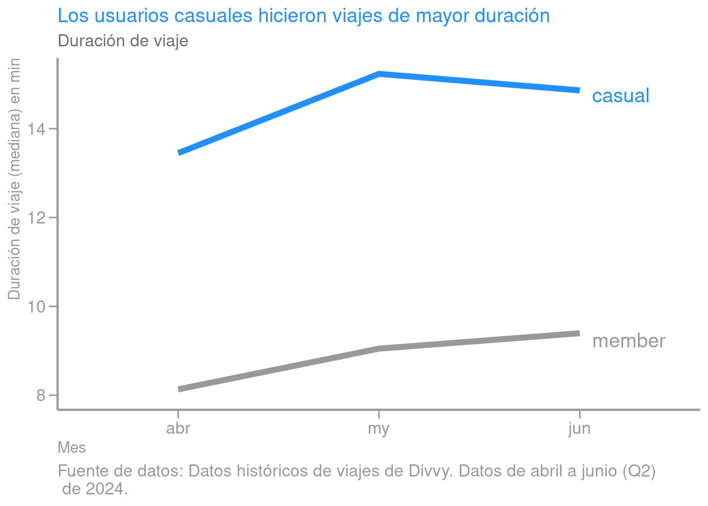

 Al nivel semanal, los usuarios casuales tienen una duración mediana de 14.3 minutos o un 58.63% más si se compara
con los usuarios anuales (9 minutos). Ambos tipos de usuarios realizaron viajes de mayor duración los fines de semana. 

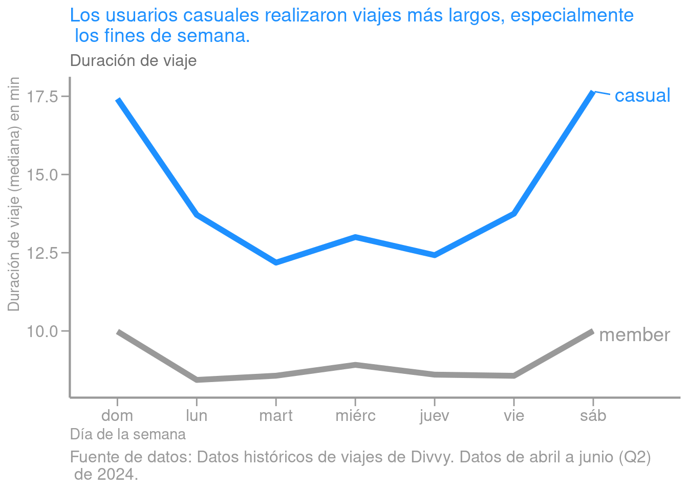

Y a nivel diario, los usuarios casuales tienen una duración mediana de 13.09 minutos o un 55.35% más si se compara
con los usuarios anuales (8.44 minutos).

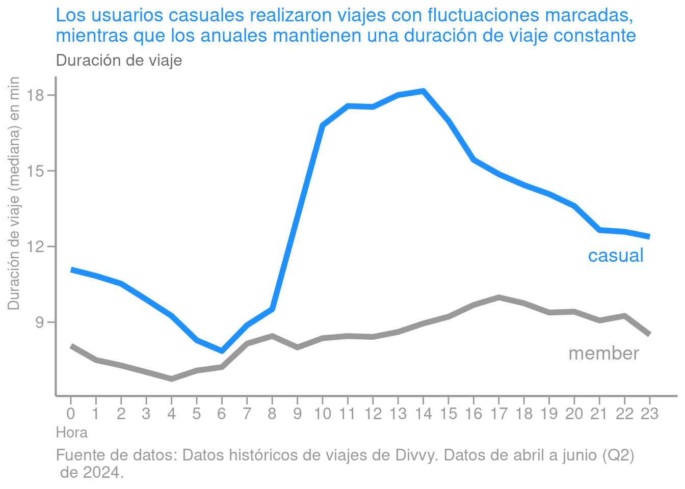

Esto también revela que los usuarios casuales realizaron viajes con duraciones fluctuantes mientras
 que los usuarios anuales se mantienen más constantes.

#### Distancia de viaje

Los viajes de usuarios casuales tienen una distancia mediana de 1.71 km o un 13.2% más si se
 compara con los usuarios anuales (1.51 km). Esto se mantiene en diferentes granularidades. Al
 nivel mensual, los usuarios casuales realizaron viajes con un distancia mediana de 1.74 km o un
 14.15% más si se compara con los usuarios anuales (1.52 km).

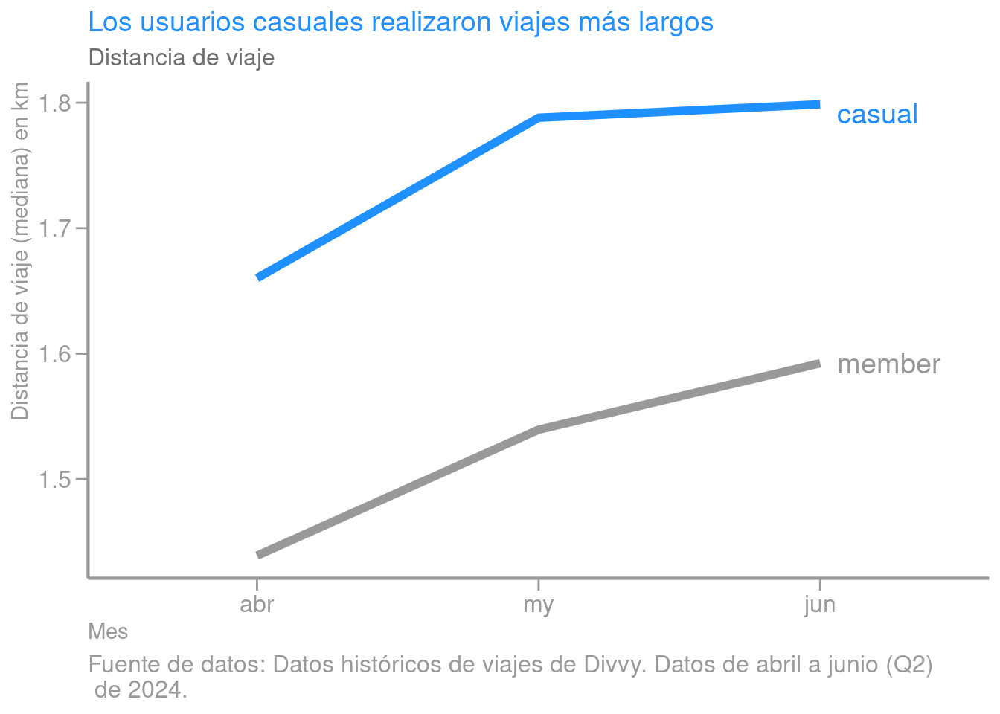

Al nivel semanal, los usuarios casuales realizaron viajes con un distancia mediana de 1.74 km o un
13.4% más si se compara con los usuarios anuales (1.53 km). Ambos tipos de 
usuarios realizaron viajes más largos los fines de semana. 

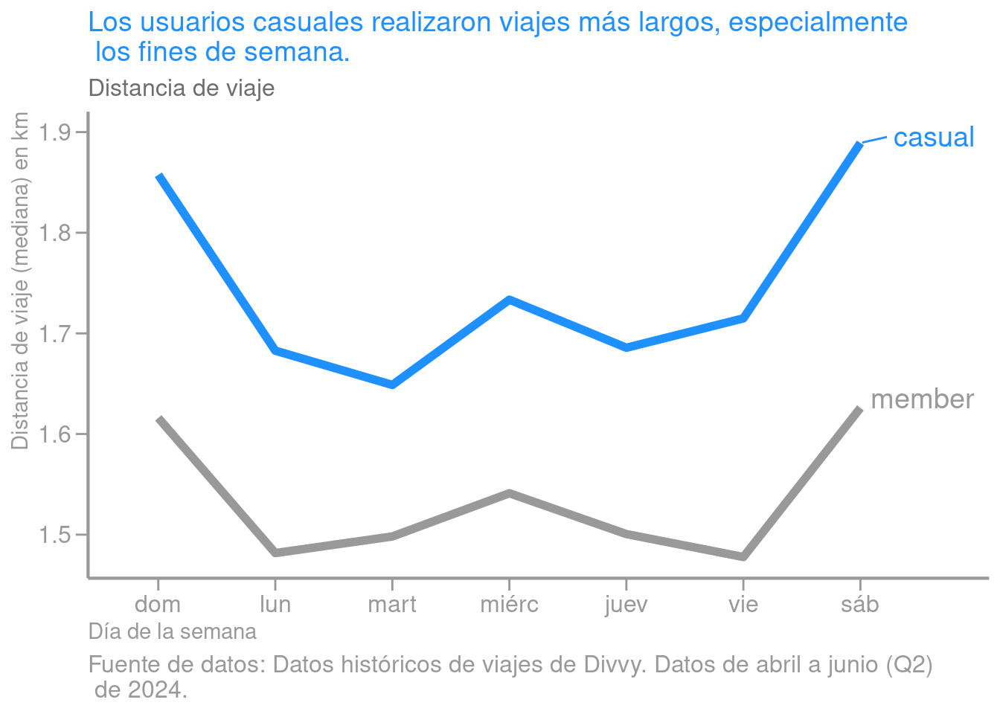

Y a nivel diario,  los usuarios casuales realizaron viajes con un distancia mediana de 1.67 km o un 12.3% más si se compara con los usuarios anuales (1.49 km)

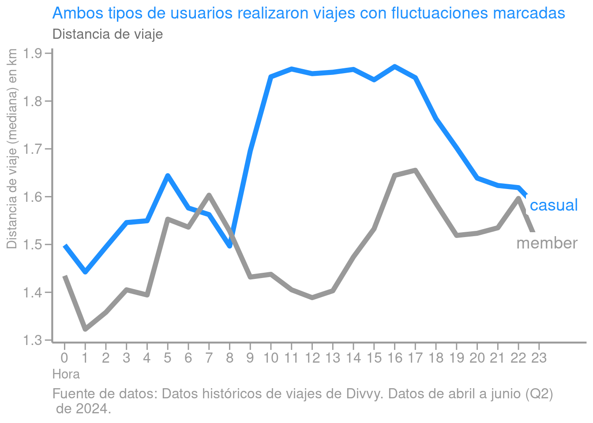

Esto también revela que ambos tipos de usuarios realizaron viajes con distancia fluctuantes.

#### Frecuencia de viajes

Los usuarios anuales realizaron más viajes (73.44%) que usuarios casuales al inspeccionarlo en diferentes granularidades. Realizaron 617,510 viajes
 en el último trimestre, mientras que los usuarios casuales hicieron 354,863.

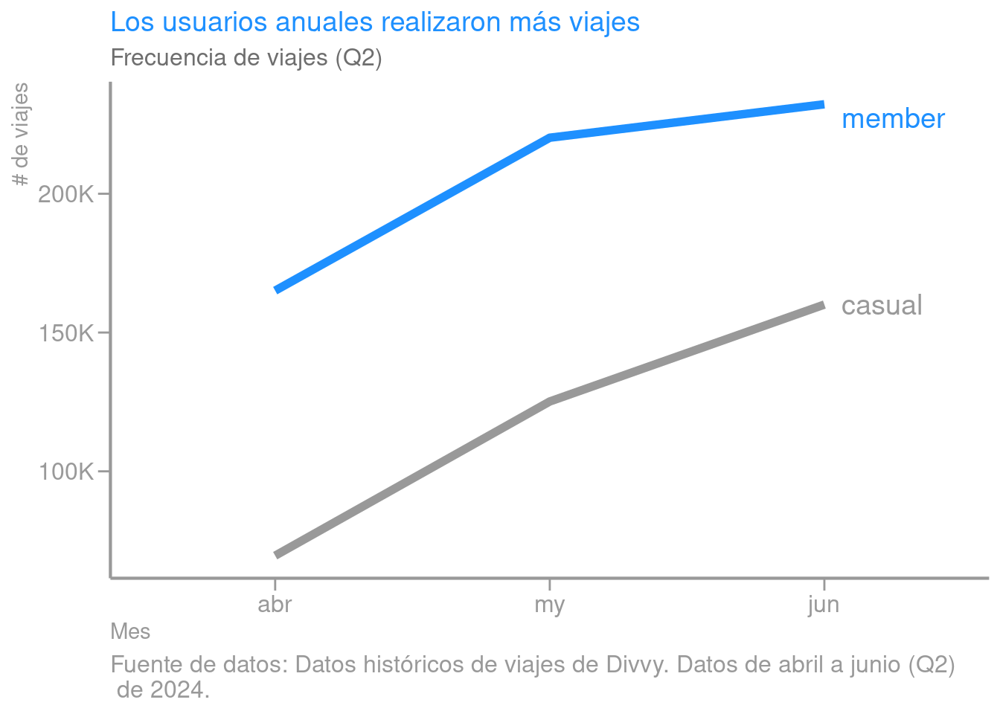

Al nivel semanal, los usuarios anuales realizaron en promedio 88,216 viajes, mientras que los usuarios casuales realizaron
50,694 viajes, esto representa un 74.25% más. Los usuarios anuales viajaron con más frecuencia los días entre semana, mientras
 que los usuarios casuales lo contrario. 

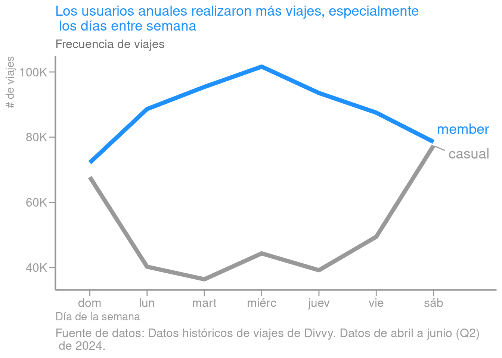

Y a nivel diario, los usuarios anuales realizaron en promedio 25,730 viajes, mientras que los usuarios casuales realizaron
14,786 viajes, esto representa un 74.01% más. Esto revela que ambos tipos de usuarios realizaron viajes con una frecuencia fluctuante a
 diferentes horas del día. 

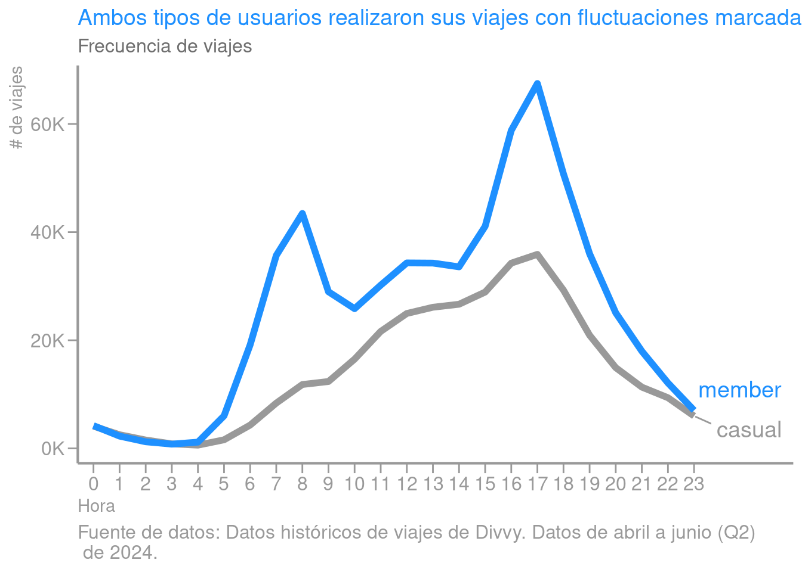

#### Preferencia de tipo de bicicleta

Ambos tipos de usuarios prefieren las bicicletas clásicas (62%)  para realizar sus viajes. Este patrón se mantiene de
 manera constante en diferentes granularidades.

### Análisis del comportamiento

Los usuarios anuales realizaron más viajes a las 8 am y las 5 pm. Esto podría ser debido a que este tipo de usuario usa
 las bicicletas para viajar al trabajo y regresar de este.

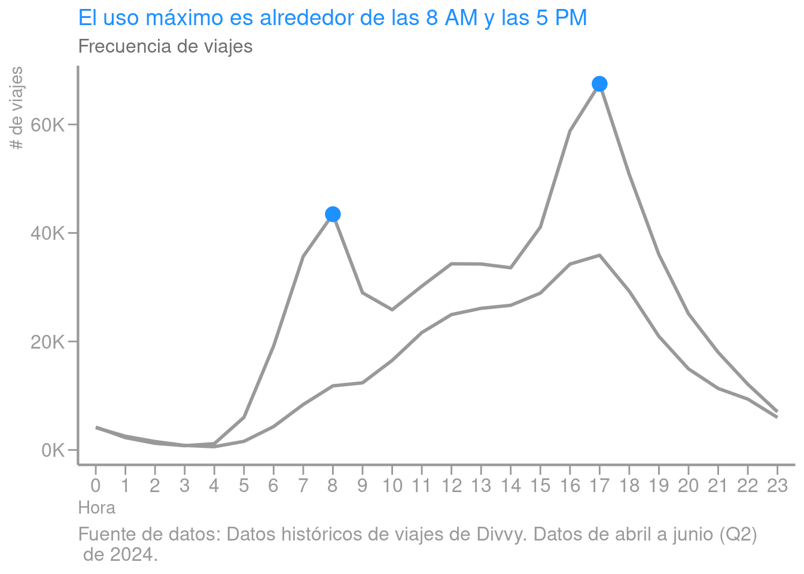

En tanto, los usuarios casuales los realizaron en el período que va desde las 1 a 4 pm. La causa de esto podría ser que
 ellos usan las bicicletas para hacer turismo u otras actividades no relacionadas con el trabajo.

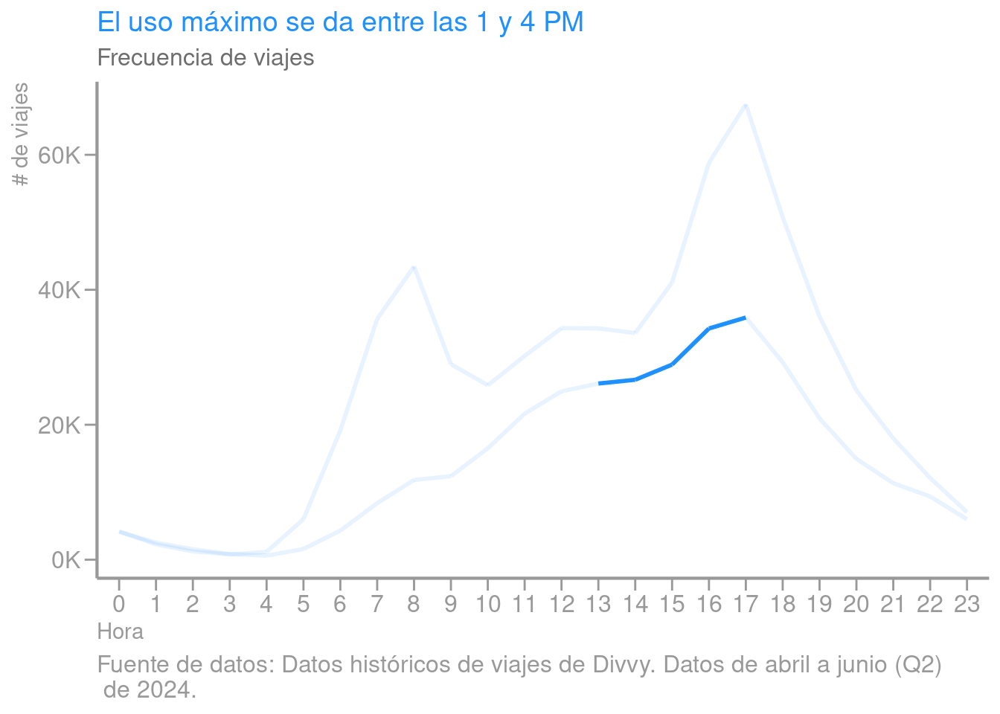

Al analizar las rutas de ambos tipos de usuarios, los usuarios anuales usaron, en su mayoría, rutas que abarcan múltiples tipos de negocios, propiedades residenciales,
 condominios, o complejos residenciales. Mientras que los usuarios casuales recorrieron en su mayoría rutas cerca del lago Michigan que incluyen parques naturales y otros 
lugares de entretenimiento. La siguiente figura nos permite entender lo anterior al visualizar las 10 rutas más usadas por tipo de usuario. La siguiente figura ilustra las 10 rutas más populares.

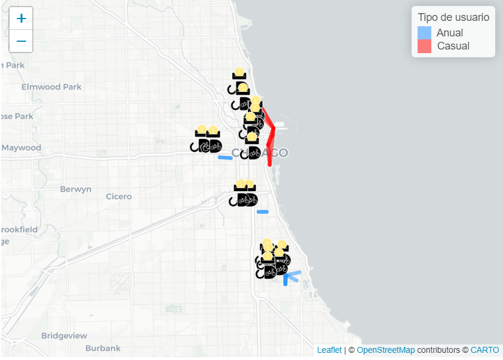

El mismo patrón se repite en estaciones. Los usuarios anuales usaron más estaciones localizadas en lugares residenciales, o cerca de negocios, con 
algunas excepciones. Mientras que los usuarios casuales usaron más estaciones que están cerca de lugares turísticos, de ocio o de lugares de renta. La siguiente
 figura nos permite entender lo anterior al visualizar las 10 estaciones más usadas por tipo de usuario.

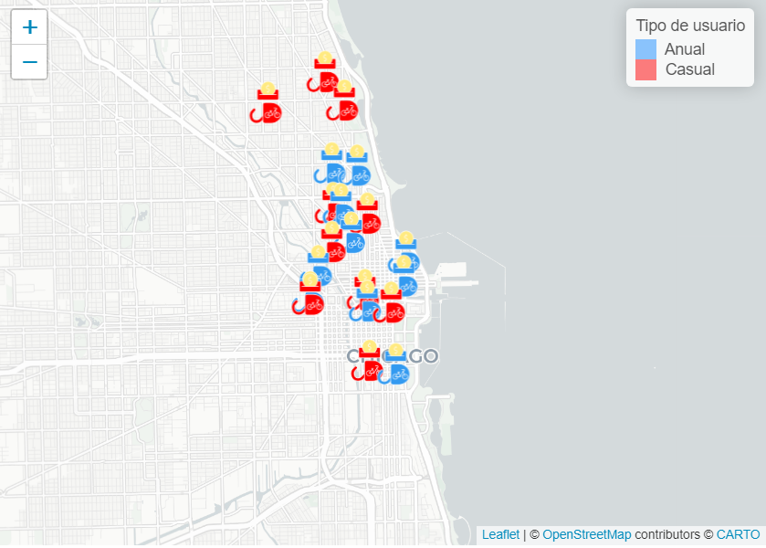

## Recomendaciones y pasos futuros

En función a los conocimientos adquiridos sobre los patrones de uso de los usuarios anuales y casuales, a continuación se ofrecen algunas recomendaciones prácticas:

- Desarrollar promociones basadas en tendencias de uso a escala temporal: Proporcionar ofertas especiales de membresías anuales durante los fines de semana. Se debe destacar los beneficios de esta, al utilizar el servicio durante los fines de semana y brindándoles la posibilidad de disfrutar los días de la semana a un precio reducido. Esto puede ampliarse en zonas concretas del día mediante publicidad emergente, alertas por correo electrónico o alertas internas en la aplicación que destaquen las ventajas de los abonos anuales, tales como viajes sin restricciones o rebajas para viajes de mayor duración.

- Aprovechar las preferencias geográficas para la publicidad dirigida: Crear anuncios dirigidos cerca de atracciones turísticas (tanto anuncios físicos como anuncios digitales como anuncios móviles geo localizados) que enfatizan la conveniencia y la rentabilidad de una membresía anual para aquellos que visitan frecuentemente estas áreas. Esto podría atraer especialmente a los turistas locales o residentes que visitan con frecuencia estos lugares, pero que no se han comprometido a una membresía anual.

- Promover la conveniencia de ir al trabajo usando membresías anuales. Dirigirse a los usuarios casuales que utilizan el sistema durante las horas pico de transporte (o cerca de estaciones residenciales) promocionando los beneficios de una membresía anual para los desplazamientos diarios. Cyclistic podría asociarse con negocios locales para ofrecer membresías corporativas donde los empleadores puedan subsidiar las membresías anuales para sus empleados.

- Destacar los beneficios de las bicicletas clásicas en los planes de membresía: Dado que ambos tipos de usuarios prefieren las bicicletas clásicas, enfatizar el uso ilimitado de bicicletas clásicas en las promociones de membresía anual. Para los usuarios casuales, enfatiza cómo la membresía permite paseos de ocio ilimitados en su tipo de bicicleta preferido.

- Mejorar las localizaciones de las estaciones para los usuarios casuales: Cyclistic podría contemplar incrementar la cantidad de estaciones próximas a zonas de turismo y entretenimiento, dado que estas son más frecuentadas por los usuarios de carácter casual.

- Fomentar ventajas únicas para los miembros anuales en estaciones de gran demanda: Proporcionar ventajas únicas a los usuarios anuales en estaciones cercanas a sitios turísticos o de ocio de gran afluencia, estas pueden ser un acceso prioritario o descuentos.